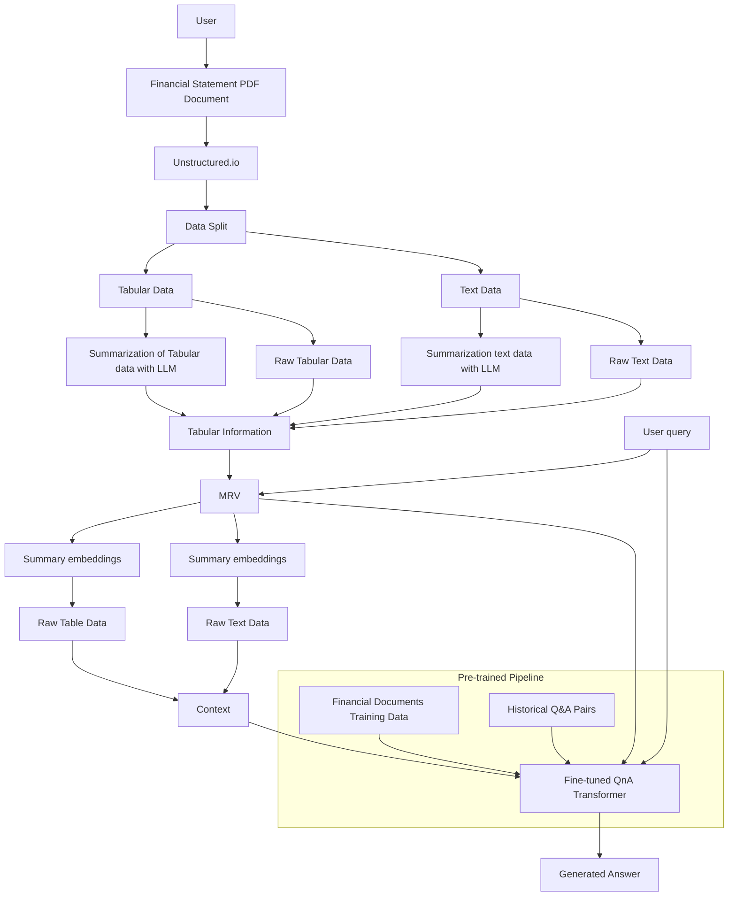

The diagram illustrates our current model approach, which may evolve in the future to incorporate enhancements and adapt to changing requirements.

```mermaid
flowchart TD
    subgraph PreTrained["Pre-trained Pipeline"]
        FinDocs["Financial Documents Training Data"] --> FT["Fine-tuned QnA Transformer"]
        QAPairs["Historical Q&A Pairs"] --> FT
    end

    %% Document processing flow
    User["User"] --> PDF["Financial Statement PDF Document"]
    PDF --> Unstructured["Unstructured.io"]
    Unstructured --> Split["Data Split"]
    Split --> Tab["Tabular Data"]
    Split --> Text["Text Data"]
    
    %% Tabular data processing
    Tab --> Sum1["Summarization of Tabular data with LLM"]
    Tab --> Raw1["Raw Tabular Data"]
    Sum1 --> TabInfo["Tabular Information"]
    Raw1 --> TabInfo
    
    %% Text data processing
    Text --> Sum2["Summarization text data with LLM"]
    Text --> Raw2["Raw Text Data"]
    Sum2 --> TabInfo["Tabular Information"]
    Raw2 --> TabInfo
    
    %% MRV and Query processing
    TabInfo --> MRV["MRV"]
    UserQ["User query"] --> MRV
    
    %% Embedding paths
    MRV --> Path1["Summary embeddings"]
    MRV --> Path2["Summary embeddings"]
    Path1 --> RawTab["Raw Table Data"]
    Path2 --> RawText["Raw Text Data"]
    
    %% Context and Final Processing
    RawTab --> Context["Context"]
    RawText --> Context
    
    MRV --> FT
    Context --> FT
    UserQ --> FT
    
    %% Final output
    FT --> Answer["Generated Answer"]
```