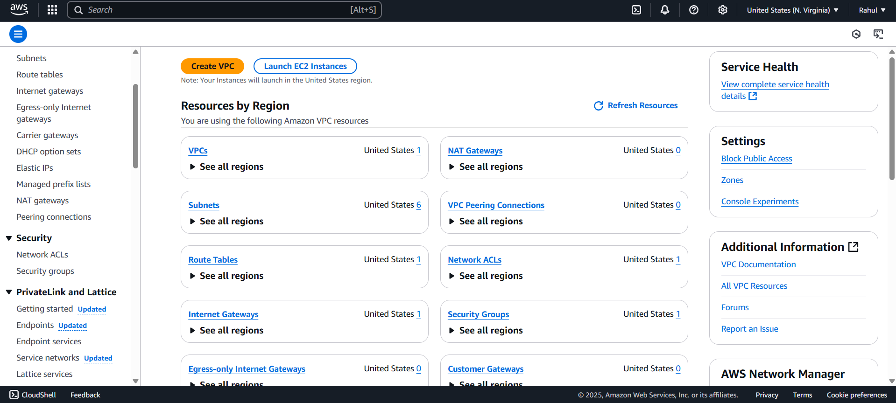
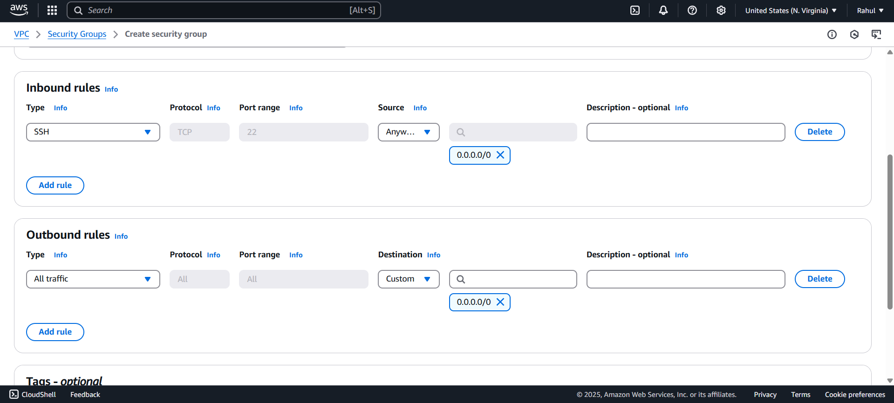
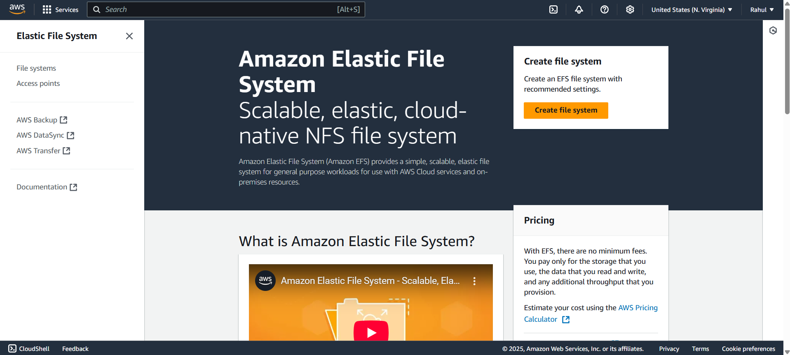

# Deploy Hugging Face Model on AWS

This document provides a comprehensive guide to deploy your Hugging Face model on AWS using EFS, EC2, and Lambda. The model is stored on AWS EFS, uploaded via an EC2 instance, and then served for inference by a Lambda function behind API Gateway.


---

## Step 1: Set up AWS EFS (Elastic File System)

1️⃣ **Create a Security Group for EFS**
1. Go to **AWS** Console -> **VPC** -> **Security Groups**

2. Click **Create Security Group**  
3. Select **SSH** for the **Inbound rules**, with **Source** selected as **Anywhere-IPv4** and then click on the **Create security group**.

4. Create another security for the efs.
5.  For this select **NFS** in the **Inbound rules** and for the Source select the **Security group created above**.
6. Click on the **Create security group**.

---

2️⃣ **Create an EFS File System**
1. Go to the **AWS** Console -> EFS (Elastic File System)
2. Click **Create File System**

3. Under **VPC**, select the **VPC** where your **EC2** and **Lambda** will run.
4. Click on the **Customize**.
5. Uncheck **Enable automatic backups** and set the **Transition into IA** to **None**, then click on **Next**.
6. For the **Mount Targets**, Select the 2 available **Availability zone**.
7. For the Security Group, select the security created for the efs, then click **Next**.
8. Click **Create**.

---

## Step 2: Launch an EC2 Instance

1️⃣ **Launch an EC2 Instance**
1. Go to **AWS** Console -> **EC2** -> **Launch Instance**
2. Give a name to the instance.
3. Select a **key pair** or click on the **Create new key pair**.
4. Under the **Network Settings**, click on **Edit**.
5. Select a **preferred Subnet**.
6. Select an already existing security group (one with the SSh inbound).
7. Click on the **"Launch Instance"**.

2️⃣ **Connecting to the Local Machine**
1. Open the **Terminal** on the folder in which key pairs are stored. With this, the local machine will be conneted to the ec2 instance.
```bash
ssh -i your-key.pem ec2-user@your-ec2-public-ip
```

2. Install the efs and git on the server.
```bash
sudo yum -y install amazon-efs-utils
sudo apt install -y git
```

3. Make an efs directory using the below code.
```bash
sudo mkdir /efs
```

4. Now, navigate to the EFS dashboard and select the efs you want to connect and click on **Attach**.
5. Copy the **EFS mount helper** and paste it into the terminal.
6. Make sure to change the `efs` to `/efs`.
7. Run the below code to make sure it is attached properly.
```bash
df -h
```
8. Use the cd command to open the `/efs` folder.
```bash
cd /efs
```

9. Clone the model on efs.
```bash
git clone https://huggingface.co/rahul14/span-arithmetic-classification
```

10. Unmount after downloading the model.
```bash
sudo umount /efs
```

## Step 3: Attach EFS to AWS Lambda
1️⃣ **Create Lambda Function**:
1. Go to **AWS** Console -> **Lambda** -> **Create Function**.
2. Select the python version you are using (in my case, it is 3.11), then click on the **Create Function**.
